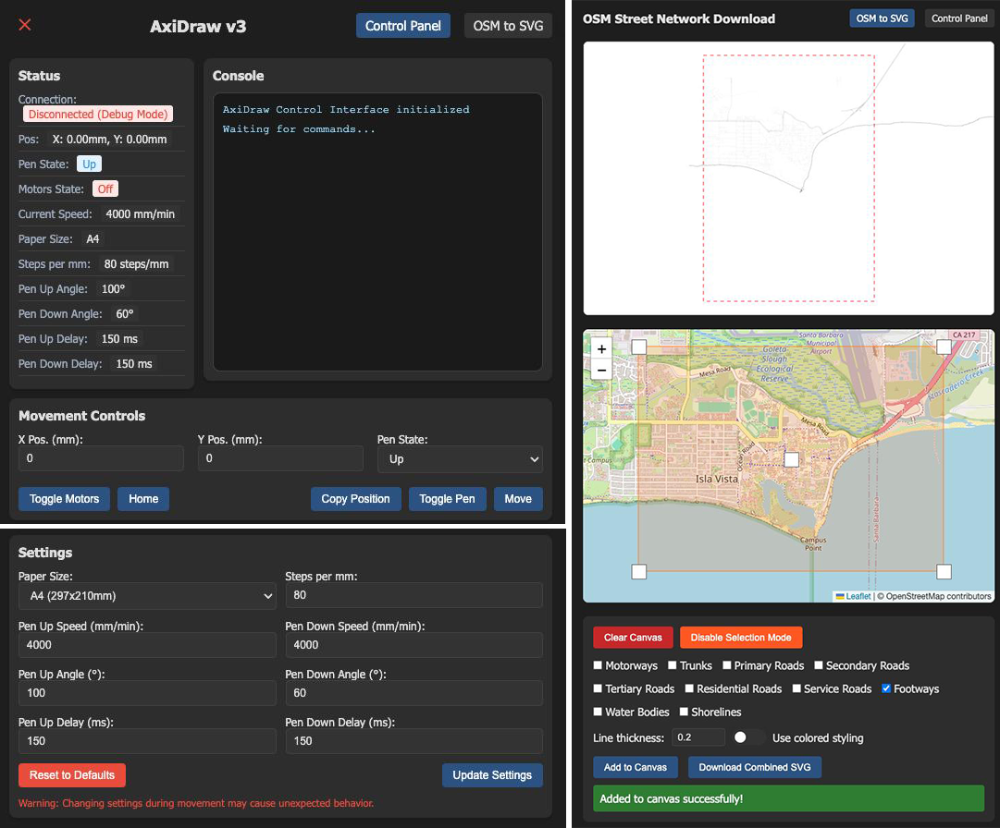

# AxiDraw Control Server

This is a Python server that provides a REST API interface to control an AxiDraw pen plotter. It allows you to send movement commands and control the pen state through HTTP requests. 

It also contains map utility that lets you download features like roads, shorelines, etc. as SVG. 



## Setup

1. Create and activate a virtual environment:
```bash
# Create a virtual environment
python -m venv venv

# Activate the virtual environment
source venv/bin/activate

# Deactivate
deactivate
```

2. Install the required dependencies:
```bash
pip install -r requirements.txt
```

3. Create a `.env` file in the project root with your AxiDraw port configuration. Similarly, possible to change hardcoded value in `axidraw_server.py`:
```
AXIDRAW_PORT=/dev/ttyUSB0  # On Linux
# or
AXIDRAW_PORT=COM3  # On Windows
# or
AXIDRAW_PORT=/dev/tty.usbserial-XXXXXX  # On macOS
```
`ls /dev/tty.*` to check the used ports. 

4. Run the server:
```bash
python axidraw_server.py
```

The server will start on `http://localhost:8000`


## Web Plotter Interface

The server includes a web-based control panel for easy interaction with the AxiDraw. To access it:

1. Start the server as described above
2. Open your web browser and navigate to:
```
http://localhost:8000/static/index.html
```

### Control Tab
The web interface provides:
- Real-time status monitoring
  - Connection status
  - Current position
  - Pen state (up/down)
- Movement controls
  - X and Y coordinate inputs
  - Duration control
  - Pen up/down selector
- Visual feedback
  - Color-coded status indicators
  - Error notifications
  - Command success/failure alerts


### OSM Composer Tab
```
http://localhost:8000/static/osm_download.html
```
- Compose an SVG with map features like roads, shorelines, etc.
  - *Note: Select and extend on the map and add consecutive features without moving this rectangle.*
  - Select extent from OSM, select lines options, add to canvas.
  - Preview combined SVG on the canvas (each add operation will be a different SVG layer). 
  - Download (use Inkscape for sending it)


## API Endpoints

### Move Command
```
POST /move
```
Send a movement command to the AxiDraw.

Request body:
```json
{
    "x": 100,        // X coordinate in mm
    "y": 100,        // Y coordinate in mm
    "pen_up": false, // Whether to keep the pen up during movement
    "duration": 1.0  // Optional: Duration of the movement in seconds
}
```

### Get Status
```
GET /status
```
Get the current status of the AxiDraw, including:
- Connection status
- Current position
- Pen state (up/down)

## Example Usage

Using curl:
```bash
# Move to position (100, 100) with pen down
curl -X POST http://localhost:8000/move \
     -H "Content-Type: application/json" \
     -d '{"x": 100, "y": 100, "pen_up": false}'

# Get current status
curl http://localhost:8000/status
```

Using Python requests:
```python
import requests

# Move command
response = requests.post('http://localhost:8000/move', json={
    'x': 100,
    'y': 100,
    'pen_up': False
})

# Get status
status = requests.get('http://localhost:8000/status').json()
```

## Notes

- Pen up/down movements have a fixed 0.5s delay to ensure proper operation
- Coordinates are in milimeters
- The server will automatically handle pen up/down commands when needed
- When no AxiDraw is connected, the server runs in debug mode and prints commands to the console 
- AxiDraw v3 User Guide: https://cdn.evilmadscientist.com/dl/ad/public/AxiDraw_Guide_v571.pdf
- Reference project that helped diagnose: https://github.com/thi-ng/umbrella/blob/develop/packages/axidraw/src/axidraw.ts#L360

- Tested with AxiDraw v3 on a MacOS Sequoia 15.3.2 (24D81) with Python 3.9.6


## Todo:
- Bezier execution and other canvas conflicts in weird ways. Need to handle these control mechanisms better. 
- Generative algorithms working in tandem with plotting 
